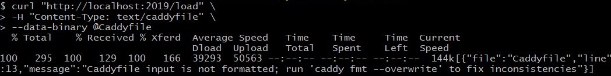
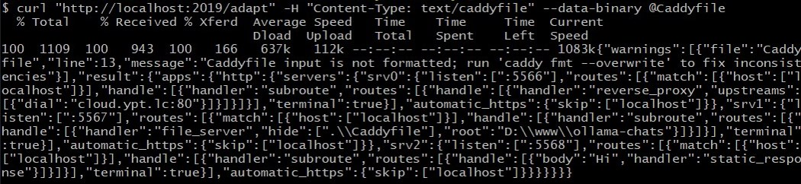

# custom caddy

## How to custom caddy

Original entrance file `github.com/caddyserver/caddy/blob/master/cmd/caddy/main.go` is native caddy with standard module plugged in.

How to custom, see annotation on top of that file:

```
// There is no need to modify the Caddy source code to customize your builds. 
// You can easily build a custom Caddy with these simple steps:

//  1. Copy `cmd/caddy/main.go` into a new folder.
//  2. Edit the imports to include the modules you want plugged in
//  3. Run `go mod init caddy`. (`go mod tidy`)
//  4. Run `go install` or `go build` - you now have a custom binary!
```

List modules:

```
$ go run main.go list-modules
```

So, current `main.go` in this dir, is our custom caddy, with ourselves' module plugged in.


## Available commands overview

`$ go run main.go`

```
Usage:
  caddy [command]

Examples:
  $ caddy run
  $ caddy run --config caddy.json
  $ caddy reload --config caddy.json
  $ caddy stop

Available Commands:
  adapt          Adapts a configuration to Caddy's native JSON
  add-package    Adds Caddy packages (EXPERIMENTAL)
  build-info     Prints information about this build
  completion     Generate completion script
  environ        Prints the environment
  file-server    Spins up a production-ready file server
  fmt            Formats a Caddyfile
  hash-password  Hashes a password and writes base64
  help           Help about any command
  list-modules   Lists the installed Caddy modules
  manpage        Generates the manual pages for Caddy commands
  reload         Changes the config of the running Caddy instance
  remove-package Removes Caddy packages (EXPERIMENTAL)
  respond        Simple, hard-coded HTTP responses for development and testing
  reverse-proxy  A quick and production-ready reverse proxy
  run            Starts the Caddy process and blocks indefinitely
  start          Starts the Caddy process in the background and then returns
  stop           Gracefully stops a started Caddy process
  storage        Commands for working with Caddy's storage (EXPERIMENTAL)
  trust          Installs a CA certificate into local trust stores
  untrust        Untrusts a locally-trusted CA certificate
  upgrade        Upgrade Caddy (EXPERIMENTAL)
  validate       Tests whether a configuration file is valid
  version        Prints the version

Flags:
  -h, --help      help for caddy
  -v, --version   version for caddy

Use "caddy [command] --help" for more information about a command.

Full documentation is available at:
https://caddyserver.com/docs/command-line
```

## Run caddy

`$ go run main.go run [-c <path> [-a <name>]] [--envfile <path>] [-e] [-r] [-w] [--pidfile <file>] [-h]`

```
Usage:
  caddy run [--config <path> [--adapter <name>]] [--envfile <path>] [--environ] [--resume] [--watch] [--pidfile <file>] [flags]

Flags:
  -a, --adapter string    Name of config adapter to apply
  -c, --config string     Configuration file
      --envfile strings   Environment file(s) to load
  -e, --environ           Print environment
  -h, --help              help for run
      --pidfile string    Path of file to which to write process ID
      --pingback string   Echo confirmation bytes to this address on success
  -r, --resume            Use saved config, if any (and prefer over --config file)
  -w, --watch             Watch config file for changes and reload it automatically
```

`$ go run main.go run -e`
```
（Caddy Windows环境变量示意）

caddy.HomeDir=C:\Users\Administrator

caddy.AppDataDir=C:\Users\Administrator\AppData\Roaming\Caddy

caddy.AppConfigDir=C:\Users\Administrator\AppData\Roaming\Caddy

caddy.ConfigAutosavePath=C:\Users\Administrator\AppData\Roaming\Caddy\autosave.json

caddy.Version=(devel)
```

## Caddyfile config reload OR adapt

```
$ go run main.go reload --config <path> [--adapter <name>] [--address <interface>] [flags]
/load 更新 Caddyfile 配置生效，reload 命令内部也是请求的 /load 接口。

$ go run main.go adapt --config <path> [--adapter <name>] [--pretty] [--validate] [--envfile <path>] [flags]
/adapt 将配置适应到 Caddy JSON，而不加载或运行它；如果成功，结果 JSON 文档将在响应主体中返回。
```

```
$ curl "http://localhost:2019/load" \
	-H "Content-Type: text/caddyfile" \
	--data-binary @Caddyfile
```




```
$ curl "http://localhost:2019/adapt" \
	-H "Content-Type: text/caddyfile" \
	--data-binary @Caddyfile
```



## Caddy SourceCode print 

1. First, Clone `github.com/gopher-lego/caddy-printcode`

2. Second, Edit ourselves `cmd/caddy/caddyfile`

3. Third, Test code by `go run main.go run` to see output print.

```
$ vi cmd/caddy/caddyfile
```

```
http://localhost:5567 {
  file_server {
    root D:\www\xxx
    browse
  }
}

http://localhost:5568 {
  respond "Hi"
}

http://localhost:5566 {
  reverse_proxy localhost:5567 localhost:5568 {
    lb_policy random {
      fallback ip_hash
    }
  }

  # Accessing pprof remotely
  reverse_proxy /debug/pprof/* localhost:2019 {
    header_up Host {upstream_hostport}
  }
}
```


## Caddy relate resources:

#### Install

https://github.com/caddyserver/caddy/?tab=readme-ov-file#install


#### Architecture

https://caddyserver.com/docs/architecture


#### API

https://caddyserver.com/docs/api

```
Caddy is configured through an administration endpoint which can be accessed via HTTP using a REST  API.
You can configure this endpoint in your Caddy config.

	Default address: `localhost:2019`

The default address can be changed by setting the `CADDY_ADMIN` environment variable.
```


#### JSON Config Structure

https://caddyserver.com/docs/json/

```
Caddy config is expressed natively as a JSON document. If you prefer not to work with JSON directly, there are many config adapters available that can convert various inputs into Caddy JSON.

Many parts of this config are extensible through the use of Caddy modules. 
```

#### Config Adapters

https://caddyserver.com/docs/config-adapters

```
The Caddyfile is a built-in config adapter
```


#### Extending Caddy (module)

https://caddyserver.com/docs/extending-caddy


#### for Development

https://github.com/caddyserver/caddy/?tab=readme-ov-file#for-development

```
$ git clone "https://github.com/caddyserver/caddy.git"
$ cd caddy/cmd/caddy/
$ go run main.go [command]  # OR `go build`
```


## Code explain

```
（命令行逻辑 rootCmd 流程）
cmd/caddy/main.go

	Caddy入口点，Caddy的功能主要通过模块提供，可以通过在导入语句中添加模块来插入。

	该程序的目的是为了定制 Caddy 构建，而无需修改源代码。可以通过复制 main.go 文件到新文件夹，编辑导入语句以包含所需模块，然后运行 go mod init caddy 和 go install 或 go build 来构建自定义二进制文件。
	也可以使用xcaddy工具来简化此过程。

	-> cmd/main.go		(由于该文件入口点中 import 了 cmd 模块，使得自动执行 cmd 目录下所有的 init 函数、包括 commands.go init中 RegisterCommand() 注册各种命令到 rootCmd上；该文件 Main() 函数被入口点调用、内部 rootCmd.Execute())

		-> cmd/cobra.go		( rootCmd 实例所在、即  &cobra.Command，WrapCommandFuncForCobra() 包裹 caddy 的 commandfunc )

		-> cmd/commandfuncs.go	( caddy 的 commandfunc：caddy 所有命令的功能逻辑的具体实现位置，如 cmdStart、cmdStart )
```

```
（命令行逻辑 cmdRun 执行流程）
cmd/main.go
	cmd/commands.go
		cmd/commandfuncs.go
-------------------------------------------------
func cmdRun(fl Flags) (int, error) {
	caddy.TrapSignals()

 	// accepted command Flag
	configFlag 		 	:= fl.String("config")
	configAdapterFlag 	:= fl.String("adapter")
	resumeFlag 			:= fl.Bool("resume")
	printEnvFlag 		:= fl.Bool("environ")
	watchFlag 			:= fl.Bool("watch")
	pidfileFlag 		:= fl.String("pidfile")
	pingbackFlag 		:= fl.String("pingback")

	// load all additional envs as soon as possible
  	handleEnvFileFlag()

  	// if we are supposed to print the environment, do that first
  	if printEnvFlag {
	}
  	
  	// load the config, depending on flags
  	if resumeFlag {
	}
	
	// we don't use 'else' here since this value might have been changed in 'if' block; i.e. not mutually exclusive
	if !resumeFlag {
		config, configFile, err = LoadConfig(configFlag, configAdapterFlag)
	}
	
	// create pidfile now, in case loading config takes a while (issue #5477)
	if pidfileFlag != "" {
	}

	// run the initial config
	err = caddy.Load(config, true)
	
	// if we are to report to another process the successful start
	if pingbackFlag != "" {
	}

	// if enabled, reload config file automatically on changes
	if watchFlag {
	}

	// warn if the environment does not provide enough information about the disk
	hasXDG := os.Getenv("XDG_DATA_HOME") != "" &&
		os.Getenv("XDG_CONFIG_HOME") != "" &&
		os.Getenv("XDG_CACHE_HOME") != ""
	switch runtime.GOOS {
	case "windows":
		
	case "plan9":
		
	default:
	}

	select {}
}

go run main.go run [-c <path> [-a <name>]] [--envfile <path>] [-e] [-r] [-w] [--pidfile <file>] [-h]
核心逻辑：
1. 有resumeFlag 即命令有 -r 标记时，读取 caddy.ConfigAutosavePath 内容作为 JSON 配置。
2. !resumeFlag 即命令没有 -r 标记时，LoadConfig() 使用指定适配器(默认caddyfile)加载并解析配置内容 转为 JSON，返回 cfgJSON []byte 格式数据。
3. caddy.Load() 是根据 cfgJSON 数据更改当下的配置，并运行（仅在配置有变更或 forceReload=true 时）它。
	内部调用 changeConfig() 执行过程如下：
		unsyncedConfigAccess(method, path, input, nil)  执行实际配置变更
		indexConfigObjects()				在给定的配置数据中查找任何ID，并将它们索引
		unsyncedDecodeAndRun(newCfg, true)。		尝试加载新的配置 并执行，若加载失败，则需回滚至旧的Caddy配置表示状态。
			其中 unsyncedDecodeAndRun(newCfg, true)  内部先执行 run(newCfg, true) 运行配置内容 newCfg、启动各模块的Start()，随后把内容写入文件 ConfigAutosavePath。
				run(newCfg, true) 过程：
				1 provisionContext：根据提供的配置创建一个新的执行环境（Context），并准备存储和服务应用。 不进行 replaceAdminServer

				2 执行 admin.api 模块的启动设置步骤 Provision

				3 newCfg 的 ctx.cfg.apps 调用 Start() 方法启动。
					events、http、tls

				4 finishSettingUp - 在所有 apps 成功 started 之后。


```
