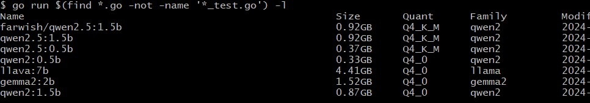

# gollama

Project [gollama](https://github.com/sammcj/gollama)

*Ollama official CLI tool for managing and running models is enough in general.*

### Features

* List available models
* Display metadata such as size, quantisation level, model family, and modified date
* Edit / update a model's Modelfile
* Sort models by name, size, modification date, quantisation level, family etc
* Select and delete models
* Run and unload models
* Inspect model for additional details
* Calculate approximate vRAM usage for a model
* Link models to LM Studio
* Copy / rename models
* Push models to a registry
* Show running models

### Usage overview

```bash
$ go get
$ go run $(find *.go -not -name '*_test.go') -h   # from gollama project readme.md
```

Output:
```
flag needs an argument: -h
Usage of C:\Users\ADMINI~1\AppData\Local\Temp\go-build1056486286\b001\exe\app_model.exe:
  -H    Shortcut to connect to http://localhost:11434
  -L    Link a model to a specific name
  -cleanup
        Remove all symlinked models and empty directories and exit
  -e    Edit a model's modelfile
  -fits float
        Highlight quant sizes and context sizes that fit in this amount of vRAM (in GB)
  -h string
        Override the config file to set the Ollama API host (e.g. http://localhost:11434)
  -l    List all available Ollama models and exit
  -lm-dir string
        Custom LM Studio models directory
  -no-cleanup
        Don't cleanup broken symlinks
  -ollama-dir string
        Custom Ollama models directory
  -s string
        Search - return a list of models that contain the search term in their name
  -u    Unload all models and exit
  -v    Print the version and exit
  -vram string
        Estimate vRAM usage - Model ID or Ollama model name
```

Example:
```bash
$ go run $(find *.go -not -name '*_test.go') -l
```

