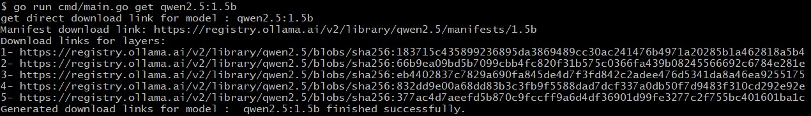

# Ollama Model Direct Download

Project [ollama-model-direct-download](https://github.com/amirrezaDev1378/ollama-model-direct-download)

### Features

* Generating direct download links for Ollama models quickly.
* Installing locally available Ollama models.

### Usage overview

```bash
$ go get ./...
$ go run cmd/main.go -h
```

Output:
```
Usage:
get <model-name>
install --model=<model-name> --blobsPath=<blobs-path>
help | -h display this help message
```

Example:
```bash
$ go run cmd/main.go get qwen2.5:1.5b
```

