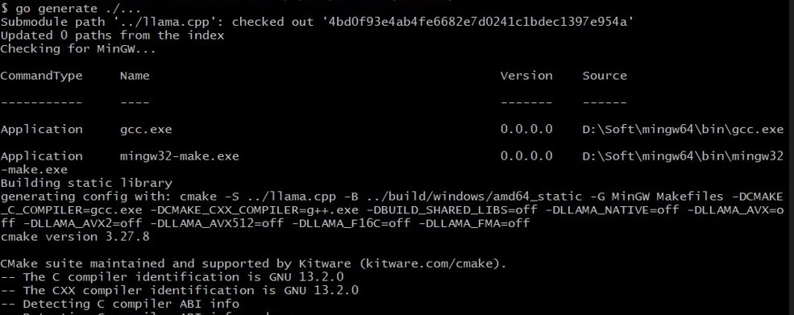
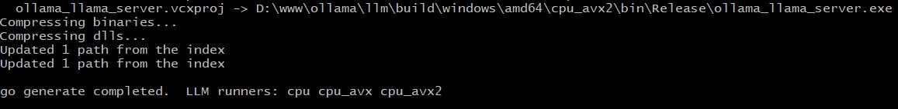
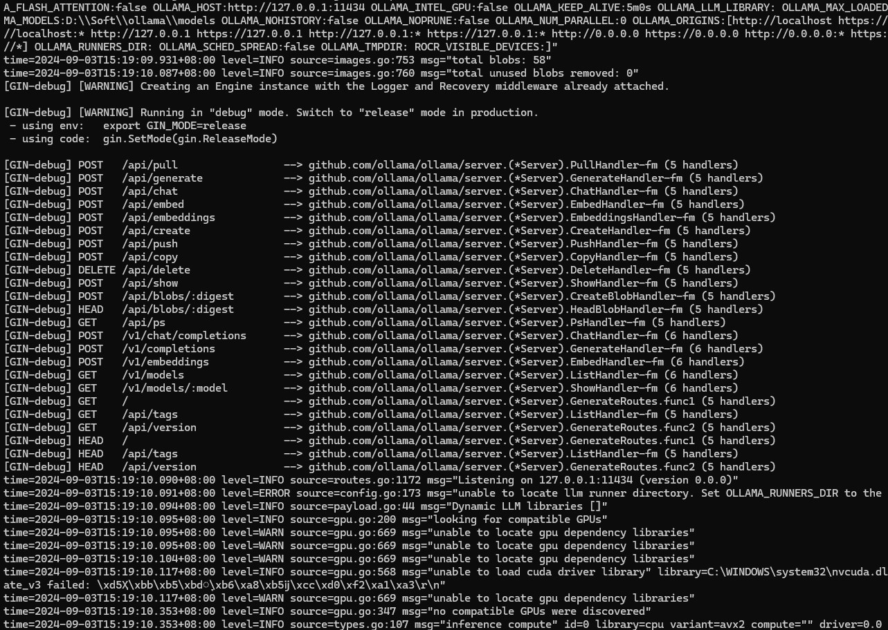

## Ollama development.

#### Get the required libraries and build the native LLM code:

```bash
$ go generate ./...
```




#### Available commands overview

```bash
$ go run main.go
```

```
Usage:
  ollama [flags]
  ollama [command]

Available Commands:
  serve       Start ollama
  create      Create a model from a Modelfile
  show        Show information for a model
  run         Run a model
  pull        Pull a model from a registry
  push        Push a model to a registry
  list        List models
  ps          List running models
  cp          Copy a model
  rm          Remove a model
  help        Help about any command

Flags:
  -h, --help      help for ollama
  -v, --version   Show version information

Use "ollama [command] --help" for more information about a command.
```

#### Serve & Run ollama (Or build the binary for run):

```bash
$ go run main.go [serve]
```


```bash
$ go run main.go [list|ps]
```

```bash
$ go run main.go [pull|show|run|push|rm] [gemma2:2b]

$ go run main.go show [--license|--modelfile|--parameters|--system|--template] [gemma2:2b]
```

```bash
$ go run main.go [cp] Source Destination
```

```bash
$ go run main.go [create] ModelName -f Modelfile -q q4_0
```

#### More detail

https://github.com/ollama/ollama/blob/main/docs/development.md